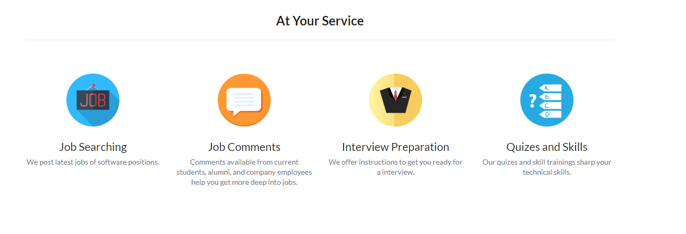
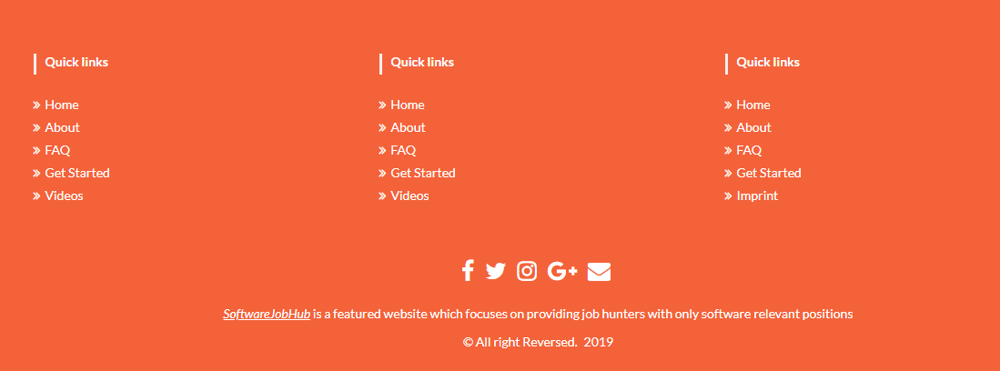
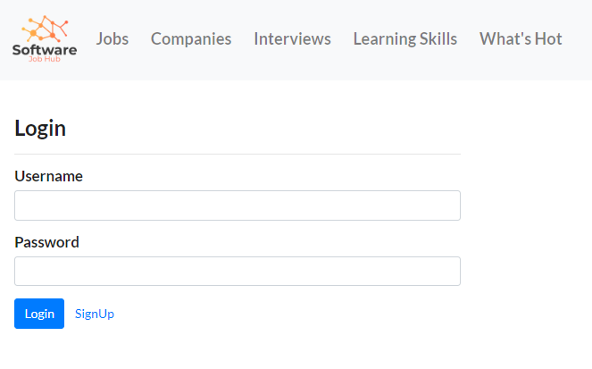
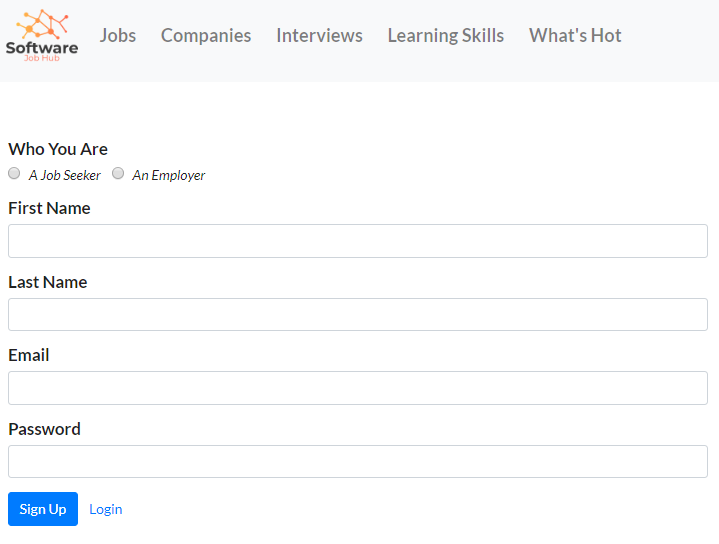
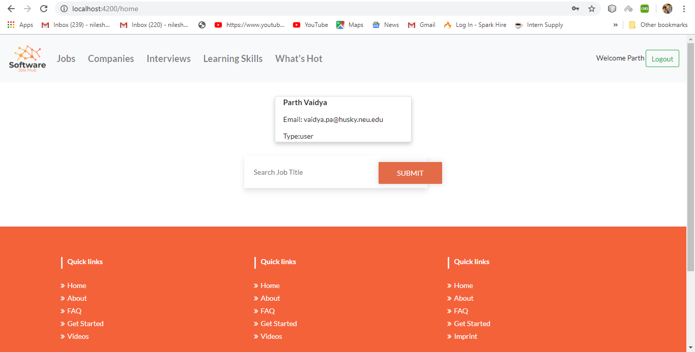
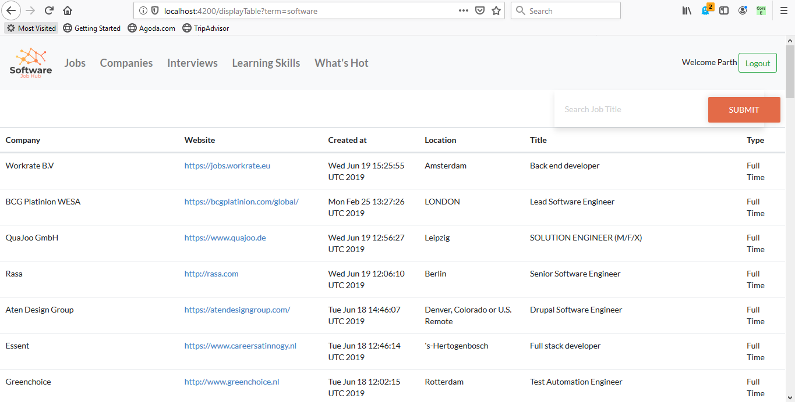
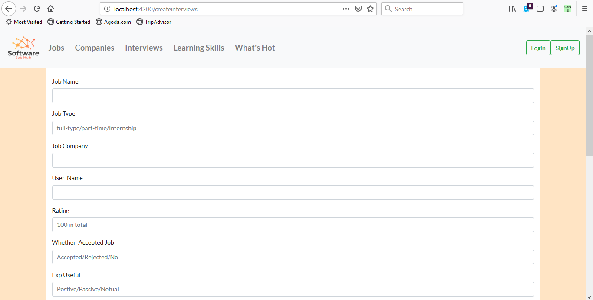

# Software_Job_Hub
 
The motivation behind this application was to create a user friendly web application for software Engineers to search jobs all over the world. We are using github jobs api to fetch all the jobs. Candidates can also add their interview experience and read other experiences. 

# Steps to run the application
** Make sure you already have Node.js, Express, MongoDB, and Angular/cli installed  

** Make sure to add to your browser(Firefox recommended) this extension: Allow CORS: Access-Control-Allow-Origin  

1. To run the server & connect to the database  
$ cd ~/Express  
$ npm install mongoose  
$ node index.js  

2. To load the landing page 
$ cd ~/Angular_JobsWebApp 
$ npm install 
$ ng serve --open 

# Screenshots

 

 

 

 

 

 

 

 

